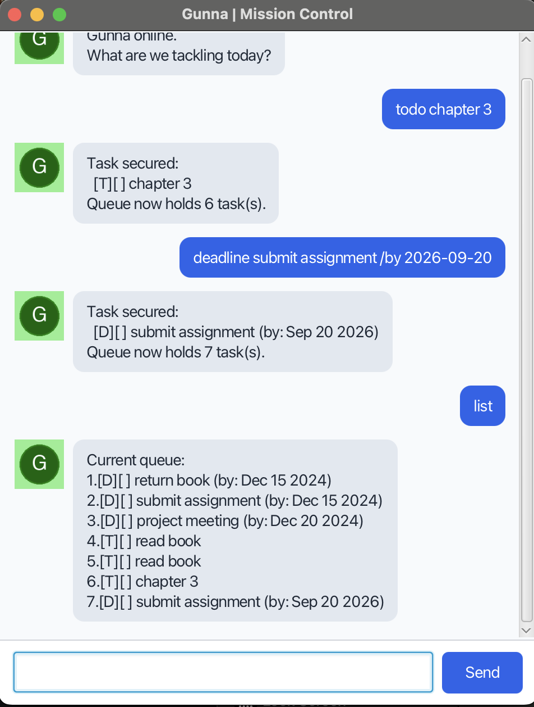

# GUNNA User Guide

Gunna is a desktop task manager with a chat-style interface. Keep track of todos,
deadlines, and events by typing commands, then search your tasks and update their
completion status as you work.



## How to use the app

1. Install Java 25 and place `gunna.jar` in a folder where Gunna can save data.
2. Open a terminal in that folder and run `java -jar gunna.jar` to launch the GUI.
   If running from the source project instead, use `./gradlew run` with Java 25.
3. Type a command into the input field and press **Enter** or click **Send**.
4. Read Gunna's reply in the chat. Try `todo read chapter 1`, followed by `list`.

Gunna automatically saves task additions, deletions, and completion changes to
`data/duke.txt`, relative to the folder you launch it from, and loads saved tasks
on startup. Launch from the same folder each time to use the same task list.

### Command conventions

- Use lowercase command words and the spaces shown in the formats below. Do not
  add leading spaces; enter `list` and `bye` without extra spaces or arguments.
- Replace uppercase placeholders such as `DESCRIPTION` with your own text.
  Descriptions may contain spaces. Do not type the placeholder names.
- `NUMBER` is a task's position in the full `list`, starting at **1**.
  Run `list` before marking, unmarking, or deleting a task: `find`, `on`, and `sort`
  number their results separately, and those numbers may differ from the full list.
- New tasks start incomplete. `[ ]` means incomplete and `[X]` means complete.
  `[T]`, `[D]`, and `[E]` identify todos, deadlines, and events respectively.

## Command summary

| Command | Format | Purpose |
| --- | --- | --- |
| `todo` | `todo DESCRIPTION` | Add a task without a date. |
| `deadline` | `deadline DESCRIPTION /by DATE` | Add a task with a due date. |
| `event` | `event DESCRIPTION /from START /to END` | Add an event with start and end text. |
| `list` | `list` | Show all tasks. |
| `sort` | `sort status` | Display incomplete tasks before completed tasks. |
| `sort` | `sort description` | Display tasks alphabetically, ignoring case. |
| `sort` | `sort date` | Display deadlines first, earliest due date first. |
| `mark` | `mark NUMBER` | Mark a task complete. |
| `unmark` | `unmark NUMBER` | Mark a task incomplete. |
| `delete` | `delete NUMBER` | Remove a task. |
| `find` | `find KEYWORD` | Search task descriptions. |
| `on` | `on DATE` | Show deadlines due on a date. |
| `bye` | `bye` | Display a farewell; exit in console mode. |

## Command details

### Add a todo: `todo`

**Format:** `todo DESCRIPTION`

Adds a task with no date or time. The description must not be empty.

**Example:** `todo read chapter 1`

If this is your first task, Gunna replies:

```text
Task secured:
  [T][ ] read chapter 1
Queue now holds 1 task(s).
```

### Add a deadline: `deadline`

**Format:** `deadline DESCRIPTION /by DATE`

Adds a task with a due date. Both the description and date are required.
Use **`yyyy-MM-dd`**: a four-digit year, two-digit month, and two-digit day,
such as `2026-09-30`. Do not include a time. Dates are displayed in a form such
as `Sep 30 2026` (the month abbreviation depends on your system's locale).

**Example:** `deadline submit report /by 2026-09-30`

Gunna confirms the addition and the updated task count. The task appears as:

```text
[D][ ] submit report (by: Sep 30 2026)
```

### Add an event: `event`

**Format:** `event DESCRIPTION /from START /to END`

Adds an event. The description, start, and end must all be nonempty. Include
both `/from` and `/to`, in that order, with spaces around them.

Start and end values are stored as **free text**, so no date format is required.
Gunna does not validate their dates or check that the end is after the start.

**Example:** `event project meeting /from Monday 2pm /to Monday 4pm`

Gunna confirms the addition and the updated task count. The task appears as:

```text
[E][ ] project meeting (from: Monday 2pm to: Monday 4pm)
```

### View all tasks: `list`

**Format and example:** `list`

Shows all tasks in queue order, including completed tasks, with numbers starting
at 1. For example, after adding the three tasks above:

```text
Current queue:
1.[T][ ] read chapter 1
2.[D][ ] submit report (by: Sep 30 2026)
3.[E][ ] project meeting (from: Monday 2pm to: Monday 4pm)
```

An empty list displays only `Current queue:`.

### Sort the displayed tasks: `sort`

**Format:** `sort status / sort description / sort date`

Choose one of these commands; the slashes above separate alternatives.

- **`sort status`** displays incomplete tasks first and completed tasks afterward.
  Relative order within each status group remains stable.
- **`sort description`** displays tasks alphabetically by description,
  ignoring letter case.
- **`sort date`** displays deadlines first, earliest deadline first. Todos and
  events appear afterward while retaining their relative order.

**Example:** `sort date` shows tasks under `Here are your tasks sorted by date:`.

Sorting is **display-only and temporary**. It does not change the underlying
TaskList or persisted task order. Running `list` afterward shows the normal
original task order. Use numbers from `list` when marking, unmarking, or deleting.

Invalid usage produces the following replies:

- `sort`: `Sort criterion required.`
- `sort banana`: `Invalid sort criterion.`

Both replies include `Usage: sort status / sort description / sort date`.

### Mark a task complete: `mark`

**Format:** `mark NUMBER`

Marks the selected task complete. It stays in the list and its status becomes
`[X]`. Marking an already completed task leaves it complete.

**Example:** `mark 1`

For the todo above, Gunna replies:

```text
Marked complete:
  [T][X] read chapter 1
```

### Mark a task incomplete: `unmark`

**Format:** `unmark NUMBER`

Marks the selected task incomplete, changing its status to `[ ]`. Unmarking an
already incomplete task leaves it incomplete.

**Example:** `unmark 1`

For the todo above, Gunna replies:

```text
Returned to queue:
  [T][ ] read chapter 1
```

### Delete a task: `delete`

**Format:** `delete NUMBER`

Removes the selected task immediately. Gunna replies with `Removed from the queue:`,
the removed task, and the remaining task count. Later tasks are renumbered.
There is no undo command.

**Example:** `delete 1` removes the first task in the full list.

### Search descriptions: `find`

**Format:** `find KEYWORD`

Finds tasks whose descriptions contain the supplied text, ignoring letter case.
Partial words match; multiple words are treated as one phrase. The search includes
all task types and both completed and incomplete tasks.

**Example:** `find REPORT` matches `submit report`.

Matches appear under `Matches in queue:`. If there are none, Gunna replies
`No matching tasks in the queue for: REPORT`.

### Find deadlines by date: `on`

**Format:** `on DATE`

Shows deadlines whose due date equals `DATE`, including completed deadlines.
Use **`yyyy-MM-dd`**, as for `deadline`. Todos and events are not included,
even if an event's start or end text contains that date.

**Example:** `on 2026-09-30`

The report deadline above appears under `Schedule for Sep 30 2026:`. If no
deadlines match, Gunna replies `No tasks scheduled for Sep 30 2026`.

### Say goodbye: `bye`

**Format and example:** `bye`

Gunna replies `Gunna signing off. See you next mission.` In the GUI, the window
remains open; use the window's close button to quit. In console mode, `bye`
ends the command loop and exits.

## Common errors

Gunna displays an error reply when a command cannot be processed. Correct the
input and send it again.

| Problem | What to do |
| --- | --- |
| Unknown command, such as `help` or `Todo read` | Use a lowercase command from the summary. |
| Missing description, such as `todo` | Supply task details after the command word. |
| Missing `/by`, `/from`, or `/to` | Follow the command format, including spaces and delimiter order. |
| Missing deadline date or event start/end | Supply every required value. |
| Unrecognized date, such as `30/09/2026` | Use `yyyy-MM-dd` for `deadline` and `on`. |
| Missing or non-integer task number | Use a whole number, such as `mark 1`. |
| Task number outside the list | Run `list` and choose a number from 1 to the current task count. |
| Empty `find` or `on` argument | Supply search text or a date respectively. |

If tasks do not persist, check that the launch folder and its `data` directory are
writable. Storage errors are printed to the terminal and may not appear in the GUI.
